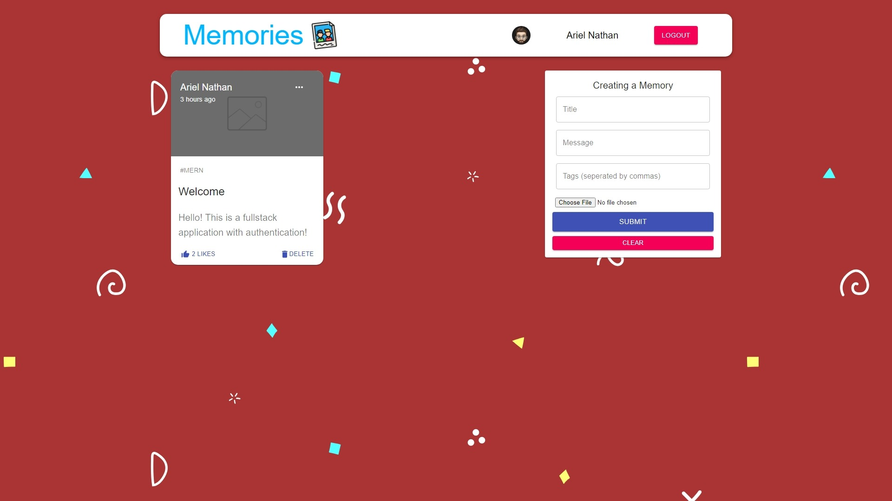

<!--
*** Thanks for checking out the Best-README-Template. If you have a suggestion
*** that would make this better, please fork the repo and create a pull request
*** or simply open an issue with the tag "enhancement".
*** Thanks again! Now go create something AMAZING! :D
***
***
***
*** To avoid retyping too much info. Do a search and replace for the following:
*** ariel-nathan, React-Memories, twitter_handle, email, project_title, project_description
-->

<!-- PROJECT SHIELDS -->
<!--
*** I'm using markdown "reference style" links for readability.
*** Reference links are enclosed in brackets [ ] instead of parentheses ( ).
*** See the bottom of this document for the declaration of the reference variables
*** for contributors-url, forks-url, etc. This is an optional, concise syntax you may use.
*** https://www.markdownguide.org/basic-syntax/#reference-style-links
-->

![lastcommit-shield]
[![MIT License][license-shield]][license-url]
[![LinkedIn][linkedin-shield]][linkedin-url]

<!-- PROJECT LOGO -->
<br />
<p align="center">
  <a href="https://github.com/ariel-nathan/React-Memories">
    
  </a>

  <h3 align="center">Memories App</h3>

  <p align="center">
    A fullstack 'social media' web app
    <br />
    <a href="https://github.com/ariel-nathan/React-Memories"><strong>Explore the repo »</strong></a>
    <br />
    <br />
    <a href="https://reactmemories.netlify.app/">View Demo</a>
    ·
    <a href="https://github.com/ariel-nathan/React-Memories/issues">Report Bug</a>
    ·
    <a href="https://github.com/ariel-nathan/React-Memories/issues">Request Feature</a>
  </p>
</p>

<!-- TABLE OF CONTENTS -->
<details open="open">
  <summary><h2 style="display: inline-block">Table of Contents</h2></summary>
  <ol>
    <li>
      <a href="#about-the-project">About The Project</a>
      <ul>
        <li><a href="#built-with">Built With</a></li>
      </ul>
    </li>
    <li>
      <a href="#getting-started">Getting Started</a>
      <ul>
        <li><a href="#installation">Installation</a></li>
      </ul>
    </li>
    <li><a href="#contributing">Contributing</a></li>
    <li><a href="#license">License</a></li>
    <li><a href="#contact">Contact</a></li>
  </ol>
</details>

<!-- ABOUT THE PROJECT -->

## About The Project

<p align="center">
  
</p>

Memories is a social media app where anyone can make a free account, sign in, and then create, edit, delete, and like posts.

### Built With

- [MongoDB](https://www.mongodb.com/)
- [Express](https://expressjs.com/)
- [Node](https://nodejs.org/en/)
- [React](https://reactjs.org/)
- [Redux](https://react-redux.js.org/)
- [Axios](https://github.com/axios/axios)
- [Material-UI](https://material-ui.com/)
- [JWT](https://jwt.io/)
- [Google Oauth](https://developers.google.com/identity/protocols/oauth2)

<!-- GETTING STARTED -->

## Getting Started

To get a local copy up and running follow these simple steps.

### Installation

1. Clone the repo
   ```sh
   git clone https://github.com/ariel-nathan/React-Memories.git
   ```
2. Install server NPM packages
   ```sh
   cd server
   npm install
   ```
3. Install client NPM packages
   ```sh
   cd client
   npm install
   ```
4. Fill .env.example
   ```sh
   PORT = PORT#
   CONNECTION_URL = "MONGODB_URL_STRING"
   ```
5. Start the server
   ```sh
   cd server
   npm start
   ```
6. Run the client
   ```sh
   cd client
   npm start
   ```
7. Connect to app with your favorite browser
   ```sh
   http://localhost:PORT#
   ```

<!-- CONTRIBUTING -->

## Contributing

Contributions are what make the open source community such an amazing place to be learn, inspire, and create. Any contributions you make are **greatly appreciated**.

1. Fork the Project
2. Create your Feature Branch (`git checkout -b feature/AmazingFeature`)
3. Commit your Changes (`git commit -m 'Add some AmazingFeature'`)
4. Push to the Branch (`git push origin feature/AmazingFeature`)
5. Open a Pull Request

<!-- LICENSE -->

## License

Distributed under the MIT License. See `LICENSE` for more information.

<!-- CONTACT -->

## Contact

Ariel Nathan - me@arielnathan.com

Project Link: [https://github.com/ariel-nathan/React-Memories](https://github.com/ariel-nathan/React-Memories)

<!-- MARKDOWN LINKS & IMAGES -->
<!-- https://www.markdownguide.org/basic-syntax/#reference-style-links -->

[lastcommit-shield]: https://img.shields.io/github/last-commit/ariel-nathan/React-Memories/main?style=flat-square
[license-shield]: https://img.shields.io/github/license/ariel-nathan/React-Memories?style=flat-square
[license-url]: https://github.com/ariel-nathan/React-Memories/blob/master/LICENSE.txt
[linkedin-shield]: https://img.shields.io/badge/-LinkedIn-black.svg?style=flat-square&logo=linkedin&colorB=555
[linkedin-url]: https://linkedin.com/in/ariel-nathan
